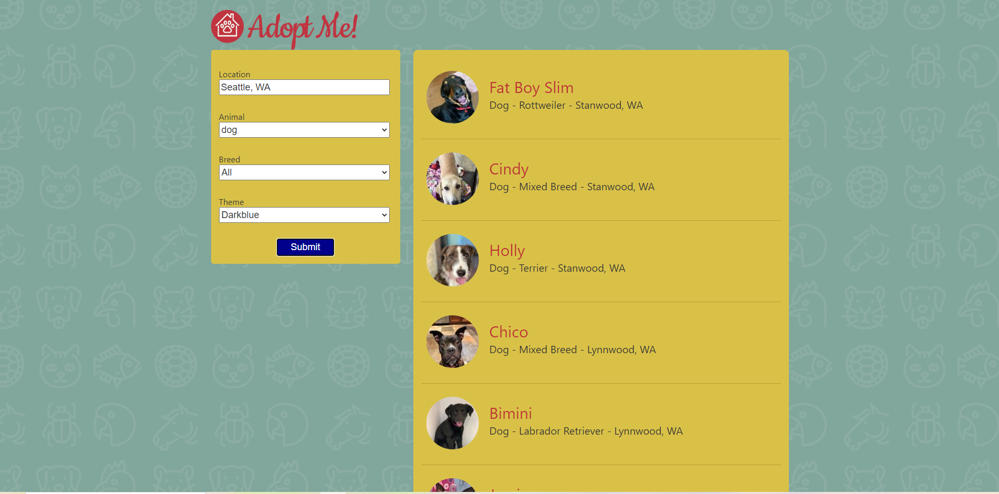
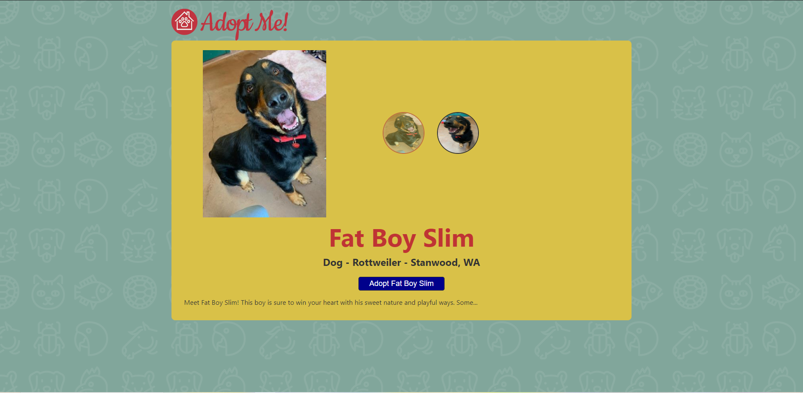

# adopt-me
React application where you can adopt pets

I made this project through a [Frontend Masters](https://frontendmasters.com/) course [Complete intro to React v5](https://frontendmasters.com/courses/complete-react-v5/).

The goal of this project was to build a react app using class components, functional components and using React API's like hooks, context, etc...

Built Upon

* [React](https://reactjs.org/)
* [reach/router](https://reach.tech/router/)
* [Parcel](https://parceljs.org/)

On this app, you can research and find different sort of pets, check their pictures and even adopt one of them !

Thanks to Frontend Masters !
